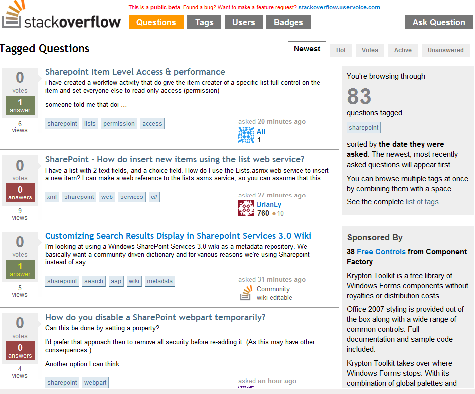

# Tagging-Stack-Overflow-posts-NLP-Case_Study
Here we will build an ANN model to predict the tag of a Stack Overflow question. We’ll train the model on 2000 comments from each of the 20 tags, so our dataset will include 40,000 examples in total. We’ll reserve 20% of this data (8,000 examples) for testing our model.

